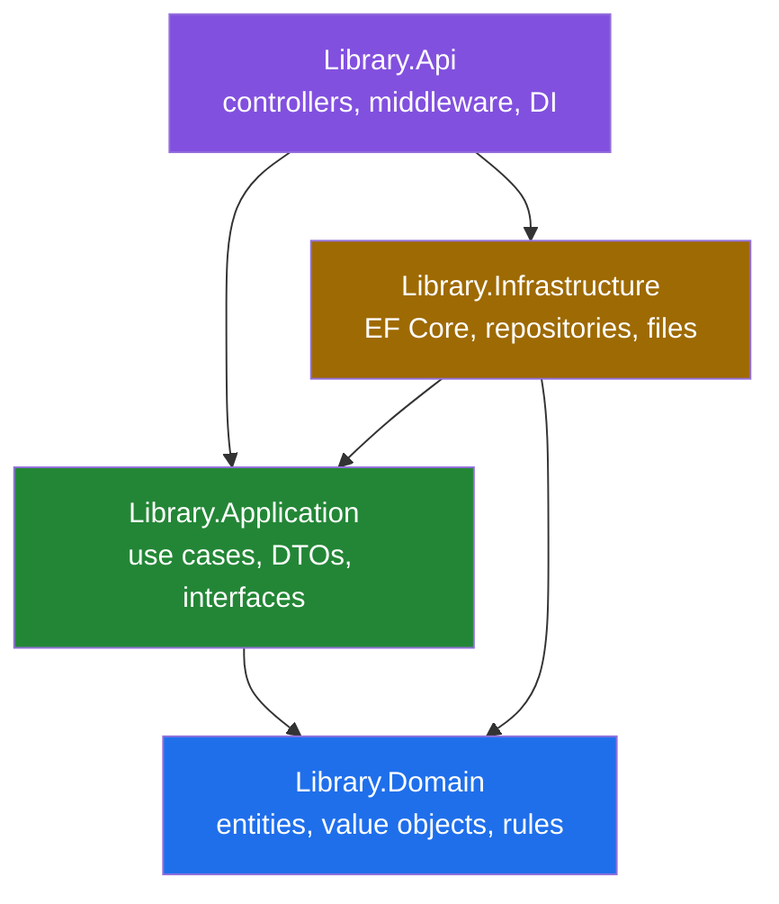

# Architecture

How this solution is organised, and why.

---

## The shape

Clean Architecture in four projects, with dependencies pointing inward only.



Note what is missing: there is no arrow from `Domain` to anything. That is the
architecture, not an omission.

---

## Why this, and not N-tier

A traditional N-tier layering — `Api → Business → Data` — looks similar on a
diagram but inverts one crucial arrow. In N-tier the entities live in the data
layer, so the business layer depends on the data layer, which depends on the
ORM. The consequence is that your business rules cannot be compiled, or tested,
without EF Core present.

Clean Architecture flips that. `Library.Domain` has **no project references and
no NuGet packages at all** — you can read `Book.cs` and see only the business,
because there is nothing else it *could* contain. `Library.Application` declares
the interfaces it needs (`IBookRepository`, `IClock`) and
`Library.Infrastructure` implements them.

At compile time the arrow points inward: `Infrastructure → Application`.
At runtime it points outward: `Program.cs` binds `IBookRepository` to
`BookRepository`, so an Application-layer service ends up calling
Infrastructure code.

That inversion is the Dependency Inversion Principle, and the reason to spend
project files on it is that **the compiler enforces it**. A comment saying "don't
reference EF Core from the domain" is a comment. A project with no reference to
EF Core cannot reference EF Core.

**What it costs.** More files, more indirection, and a genuine learning curve.
For a CRUD app with three tables and no rules it would be overhead. It earns its
place here because the system has real invariants — a copy cannot be issued
twice, fines derive from due dates — and those belong somewhere that can be
tested without a database.

---

## Layer by layer

### Library.Domain

Entities, value objects, domain events, and domain exceptions.

| Folder | Contents |
|---|---|
| `Common/` | `Entity`, `AuditableEntity`, `IDomainEvent` |
| `Entities/` | `Book`, `BookCopy`, `Author`, `Genre`, `Category`, `Publisher`, junctions |
| `Enums/` | `CopyStatus`, `CopyCondition` |
| `Exceptions/` | `DomainException` and its three subtypes |
| `ValueObjects/` | `Isbn` |

**Entity design pattern used throughout:**

```csharp
public sealed class Book : AuditableEntity
{
    private Book() { }                          // for EF Core only

    public string Title { get; private set; }   // no public setter

    private readonly List<BookCopy> _copies = [];
    public IReadOnlyCollection<BookCopy> Copies => _copies.AsReadOnly();

    public static Book Create(Isbn isbn, string title, int categoryId, ...)
    {
        if (string.IsNullOrWhiteSpace(title))
            throw new BusinessRuleViolationException("book.title_required", ...);
        return new Book(...);
    }
}
```

Three things are deliberate here:

- **The private constructor** means application code cannot create a `Book` in an
  invalid state; it must go through `Create`, which validates. EF Core can still
  materialise entities because it uses reflection.
- **`private set`** means state changes go through named methods
  (`MarkOnLoan()`, `UpdateDetails()`), each of which can enforce its own rule.
  An anaemic model with public setters has nowhere to put "you cannot withdraw a
  copy that is on loan".
- **`IReadOnlyCollection` over a private list** means a caller cannot do
  `book.Copies.Add(...)` and bypass `AddCopy`'s duplicate-barcode check.

**Entity versus value object.** A `Book` has identity: two books with the same
title are still two books, and `Entity` implements equality by `Id`. An `Isbn` is
a value: two instances holding `9780132350884` are interchangeable, so it is a
`readonly record struct` with equality by value.

### Library.Application

Use cases, DTOs, and the abstractions Infrastructure implements.

The layer answers *"what should happen when a librarian asks for book 42"* —
which is a different question from *"what is in the database"*. That distinction
is why `BookService` exists on top of `BookRepository`:

```csharp
// Repository: reports what is there.
Task<BookDetailDto?> GetByIdAsync(int id, CancellationToken ct);

// Service: decides what a miss means.
BookDetailDto book = await _repository.GetByIdAsync(id, ct);
return book ?? throw new NotFoundException("Book", id);
```

The alternative — returning `null` and having every controller remember to check
— works right up until one of them forgets, and then a `NullReferenceException`
becomes a 500 where a 404 was correct.

### Library.Infrastructure

The only project that knows a database exists.

| Folder | Contents |
|---|---|
| `Persistence/` | `LibraryDbContext`, `DatabaseOptions`, `DatabaseSeeder`, `DesignTimeDbContextFactory` |
| `Persistence/Configurations/` | One `IEntityTypeConfiguration<T>` per entity |
| `Persistence/Migrations/` | Generated — excluded from analysis in `.editorconfig` |
| `Repositories/` | `BookRepository` |
| `Services/` | `SystemClock` |

**Mapping lives in configuration classes, never as attributes on entities.** Had
`Book` carried `[Table("Books")]` and `[MaxLength(500)]`, the domain would need a
reference to EF Core and the dependency rule would be broken on line one. Keeping
mapping here also puts column widths, indexes and delete behaviour together in
one readable place per entity, instead of scattered across properties.

### Library.Api

Controllers, middleware, and the composition root. Controllers are deliberately
thin:

```csharp
[HttpGet("{id:int}")]
public async Task<ActionResult<BookDetailDto>> GetById(int id, CancellationToken ct)
{
    BookDetailDto book = await _bookService.GetByIdAsync(id, ct);
    return Ok(book);
}
```

No `try`/`catch`, because `GlobalExceptionHandler` maps every exception centrally.
No EF Core. No business logic. If a controller action grows past a handful of
lines, the logic belongs in the service.

---

## Cross-cutting concerns

### Exception handling

One `IExceptionHandler` translates exceptions into RFC 9457 ProblemDetails. The
mapping is a single `switch` expression — adding a domain exception means adding
one arm, and forgetting produces a 500, which is loud and gets noticed.

`IExceptionHandler` rather than custom middleware: before .NET 8 this was written
as middleware wrapping `next(context)` in a `try`/`catch`. `IExceptionHandler`
(registered via `AddExceptionHandler` + `UseExceptionHandler`) is the first-party
replacement, and the framework owns the plumbing.

The security property it enforces: a `DomainException` carries a message written
for the caller, so its text is returned. Anything else is a bug, so the caller
gets a generic message plus a trace id while the real exception goes to the log.

### Configuration

The Options pattern with validation at startup:

```csharp
services.AddOptions<DatabaseOptions>()
    .Bind(configuration.GetSection("Database"))
    .ValidateDataAnnotations()
    .ValidateOnStart();      // fail at boot, not on first request
```

A missing connection string kills the process at startup with a clear message,
rather than surfacing as a `NullReferenceException` on the first request that
touches the database. Fail fast and loudly; never fail obscurely under load.

### Logging

Serilog, configured from `appsettings.json` so levels and sinks are deployment
configuration rather than compiled-in code. A bootstrap logger is created first
so that failures *during* host construction are still recorded.

All logging uses `[LoggerMessage]` source-generated partial methods:

```csharp
[LoggerMessage(EventId = 5000, Level = LogLevel.Error,
    Message = "Unhandled exception on {Method} {Path}")]
private partial void LogUnhandledException(string method, string path, Exception ex);
```

The conventional `_logger.LogError("...", a, b)` boxes every value-type argument
and allocates a `params object[]` on **every** call — including calls where the
level is disabled and the message is discarded. The generated version checks
`IsEnabled` before touching the arguments. Analyzer CA1848 enforces it, and this
solution builds with warnings as errors.

### Dependency injection

Each layer exposes one extension method; `Program.cs` calls them in order:

```csharp
builder.Services.AddApplication();
builder.Services.AddInfrastructure(builder.Configuration);
```

Adding a service to a layer never touches `Program.cs`, which is otherwise the
first place every merge conflict happens.

**Lifetimes matter.** `IClock` is a singleton (stateless). `DbContext`,
repositories and services are scoped — one per request. Registering a service as
a singleton when it depends on `DbContext` is a *captive dependency*: the
singleton captures one `DbContext` and reuses it across concurrent requests,
which `DbContext` is explicitly not safe for.

### Pipeline order

Order is behaviour, not style. Each component wraps the ones after it:

```csharp
app.UseExceptionHandler();        // FIRST - must wrap everything
app.UseStatusCodePages();         // bare 404s become ProblemDetails
app.UseSerilogRequestLogging();
app.MapOpenApi(); app.UseSwaggerUiForOpenApi();   // development only
app.UseHttpsRedirection();
// Phase 5: UseAuthentication() BEFORE UseAuthorization()
app.MapControllers();
```

That last comment marks the single most common pipeline mistake in ASP.NET Core:
reversed, authorization runs against an anonymous principal and every
`[Authorize]` endpoint returns 401 regardless of the token.

---

## SOLID, concretely

Not as a checklist — these are the places the principles actually did work in
this codebase.

| Principle | Where | What it bought |
|---|---|---|
| **Single Responsibility** | `BookRepository.ApplyFilters` / `ApplySorting` / projection are separate methods | The filtering rules can be read and changed without wading through paging and projection |
| **Open/Closed** | `BookSortOptions.SortMap` | Adding a sort field is a dictionary entry; the query code is never touched |
| **Liskov Substitution** | `IClock` → `SystemClock` / `FakeClock` | A test substitutes the clock and the code under test cannot tell |
| **Interface Segregation** | `IBookRepository` exposes five focused reads, not a generic `IRepository<T>` | Callers depend only on what they use; the interface documents the actual access patterns |
| **Dependency Inversion** | `Library.Application` declares `IBookRepository`; `Library.Infrastructure` implements it | Application compiles and unit-tests with no database and no EF Core |

The Open/Closed example is the most concrete. Dynamic sorting is normally
implemented by interpolating the caller's string into the query, which hands
them control of your SQL. Here the string is used to *look up* a pre-built
expression tree:

```csharp
SortMap = new Dictionary<string, Expression<Func<Book, object?>>>(
        StringComparer.OrdinalIgnoreCase)
{
    ["title"]     = book => book.Title,
    ["published"] = book => book.PublishedOn,
    // ...
};
```

Extending the behaviour means adding an entry. Modifying the query code is never
necessary — and an unrecognised key matches nothing and falls back to the
default, which closes the injection surface entirely.

---

## Patterns used

| Pattern | Where | Why |
|---|---|---|
| Repository | `IBookRepository` | Keeps `IQueryable` out of the upper layers; the seam CQRS slides into later |
| Unit of Work | `LibraryDbContext` | EF Core already is one; not wrapped further |
| Value Object | `Isbn` | Makes an invalid ISBN unrepresentable rather than merely unlikely |
| Factory Method | `Book.Create`, `Isbn.Create` | Validation cannot be skipped |
| Options | `DatabaseOptions` | Typed configuration, validated at startup |
| Strategy | `BookSortOptions.SortMap` | Behaviour selected by key, closed to modification |
| Domain Events | `IDomainEvent` (Phase 4) | Side effects dispatch *after* the transaction commits |
| Specification-ish | `ApplyFilters` | Composable predicates over `IQueryable` |

---

## Deferred deliberately

**CQRS.** Read and write models are not split. The reads are already projected
through DTOs and the service layer, so the seam exists; Phase 10 can add
`Application/Features/Books/{Commands,Queries}` and a mediator without
restructuring anything. Doing it now would add indirection before there is
enough behaviour to justify it.

**A generic `IRepository<T>`.** Deliberately absent. Generic repositories tend to
leak `IQueryable` back out to satisfy callers whose needs the generic interface
did not anticipate — at which point the abstraction has bought nothing and cost
a layer.

**Mapping libraries.** Mapster is referenced but projections are written by hand
inside the EF `Select`, because that is what makes them translate into the SQL
column list. A mapper applied after materialisation would silently reintroduce
over-fetching and N+1 queries.

---

## Further reading

- [`data-model.md`](data-model.md) — schema, normalisation, indexes
- [`data-flow.md`](data-flow.md) — request pipeline and sequence diagrams
- [`phases/`](phases/) — the decision-by-decision walkthrough
