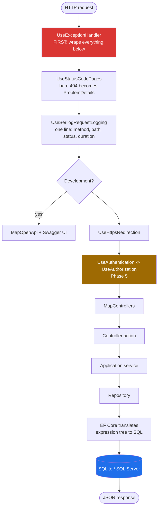
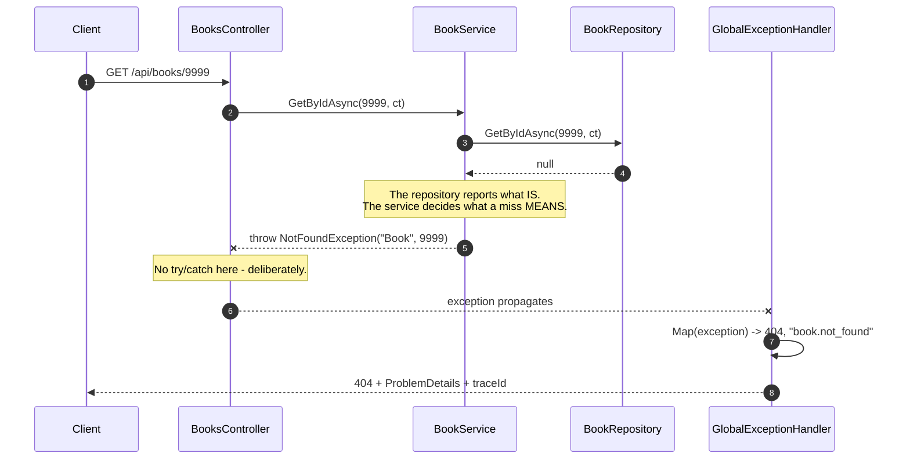
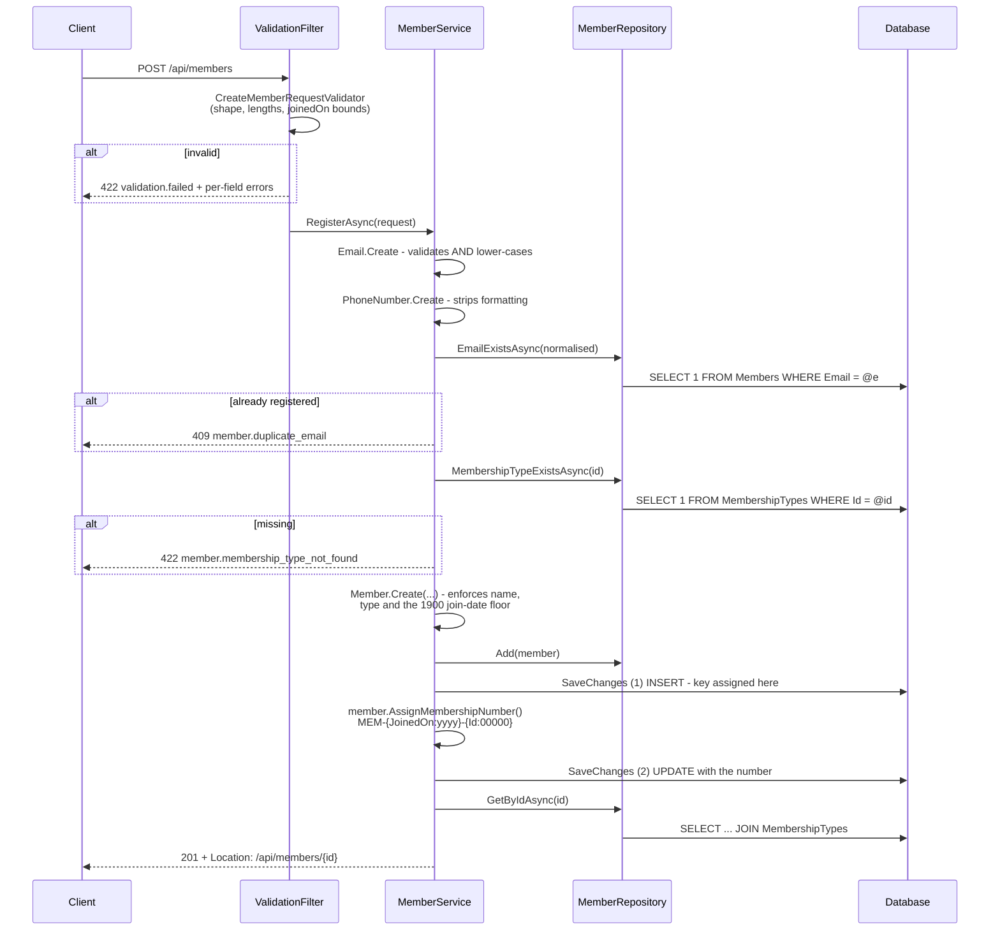
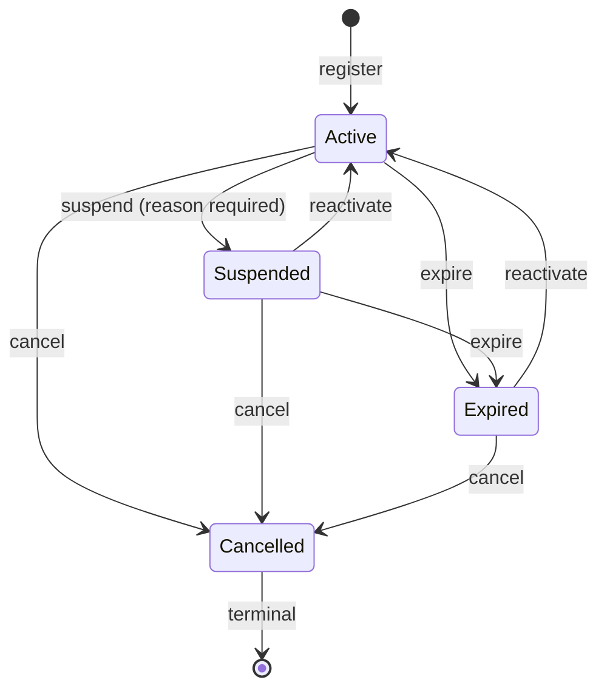
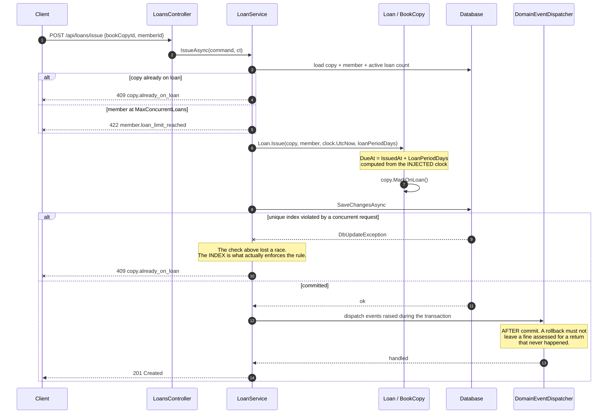
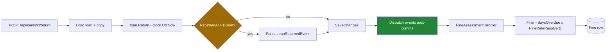
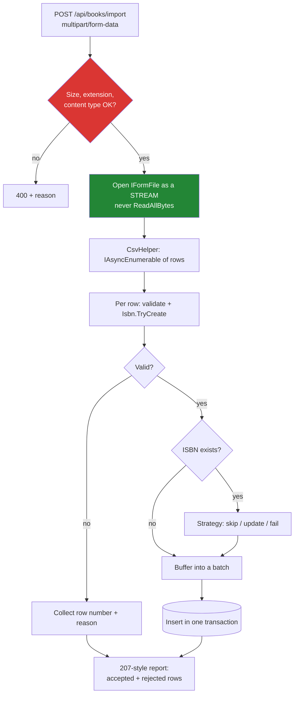

# Data Flow

How a request travels through the system, and what each layer contributes.

---

## The request pipeline

Every request passes through the same middleware stack before reaching a
controller. **Order is behaviour here, not style** — each component wraps the
ones after it, so a component only ever sees what the earlier ones have already
done.



Two placements worth calling out:

- **`UseExceptionHandler` is first**, because it must wrap everything downstream.
  Anything registered before it throws into the void.
- **`UseAuthentication` before `UseAuthorization`** (Phase 5) is the single most
  common ASP.NET Core pipeline mistake. Reversed, authorization evaluates an
  anonymous principal and every `[Authorize]` endpoint returns 401 no matter how
  valid the token is.

---

## Searching the catalogue

`GET /api/books?search=design&availableOnly=true&sortBy=title&page=1&pageSize=20`

```mermaid
sequenceDiagram
    autonumber
    participant C as Client
    participant Ctl as BooksController
    participant Svc as BookService
    participant Repo as BookRepository
    participant EF as EF Core
    participant DB as Database

    C->>Ctl: GET /api/books?search=design&...
    Note over Ctl: [ApiController] binds the query<br/>string to BookSearchRequest
    Ctl->>Svc: SearchAsync(request, ct)
    Svc->>Repo: SearchAsync(request, ct)

    Note over Repo: Normalize() clamps page/pageSize.<br/>pageSize is capped at 100.

    Repo->>Repo: AsNoTracking()
    Repo->>Repo: ApplyFilters - appends only the<br/>predicates actually supplied
    Note over Repo,EF: Nothing has executed yet.<br/>IQueryable is still an expression tree.

    Repo->>EF: CountAsync()
    EF->>DB: SELECT COUNT(*) ... WHERE ...
    DB-->>EF: 5
    EF-->>Repo: totalCount

    alt totalCount == 0
        Repo-->>Svc: PagedResult.Empty
    else
        Repo->>Repo: ApplySorting - whitelisted expression<br/>+ ThenBy(Id) tiebreaker
        Repo->>EF: Skip/Take + Select(BookSummaryDto)
        EF->>DB: SELECT columns... LEFT JOIN authors,<br/>genres, copies ... ORDER BY ... LIMIT
        DB-->>EF: rows
        EF-->>Repo: List&lt;BookSummaryDto&gt;
    end

    Repo-->>Svc: PagedResult&lt;BookSummaryDto&gt;
    Svc-->>Ctl: (passes through unchanged)
    Ctl-->>C: 200 OK + JSON
```

### What makes this two queries and not twenty-one

The projection happens **inside** the `IQueryable`, before materialisation:

```csharp
await query
    .Skip(...).Take(...)
    .Select(book => new BookSummaryDto
    {
        Title   = book.Title,
        Authors = book.BookAuthors.OrderBy(ba => ba.AuthorOrder)
                      .Select(ba => ba.Author.FirstName + " " + ba.Author.LastName)
                      .ToList(),
        AvailableCopies = book.Copies.Count(c => c.Status == CopyStatus.Available),
    })
    .ToListAsync(ct);
```

EF Core translates that shape into the SQL column list and the joins. Two
consequences:

- **No N+1.** Author names arrive with the page, not through one extra query per
  book. Calling `ToListAsync()` first and mapping afterwards would produce
  exactly that: 1 query for the page plus 20 for the authors plus 20 for the
  genres.
- **No over-fetching.** `Description` and `PageCount` are never read, because the
  summary DTO does not mention them.

`AvailableCopies` is counted **in SQL**. The domain has a
`Book.AvailableCopies` property, but it counts a loaded collection — using it
here would mean loading all 41 copies to display a number.

### Why the count query runs separately

`CountAsync` runs against the filtered query but **without** the ordering or
paging. That is what makes `totalCount` mean "matches" rather than "matches on
this page", and it is what lets the client render "page 1 of 8".

### Why sorting always appends a tiebreaker

```csharp
return ordered.ThenBy(b => b.Id);
```

SQL guarantees no ordering among rows that tie on the `ORDER BY` key. With fifty
books published in 2024 and `sortBy=published`, the database may return them in
any order — and a *different* order on the next call. Page 2 would then repeat or
skip rows that page 1 already showed. A unique tiebreaker makes the total
ordering deterministic and paging stable.

---

## Fetching one book

`GET /api/books/9999` — the not-found path, which is where the layering earns
its keep.



The controller contains no error handling at all. One handler maps every
exception in the application, so the safe behaviour is the default and the only
behaviour — rather than something each of forty actions has to remember.

---

## Registering a member

Two saves in one transaction, because the membership number is derived from a key
the database does not assign until the insert completes.



### Why two saves rather than one

The number embeds the surrogate key, and the key does not exist until the row is
inserted. The alternatives were worse: a client-supplied number lets a caller
claim an identifier that is meant to be issued, and a separate sequence table adds
a second thing to keep in step with the first.

Both saves share one `DbContext` and therefore one ambient transaction, so a
failure on the second rolls back the first. **There is no window in which a member
exists without a number** — which matters because the number is the only
identifier the librarian can see.

### Why normalisation happens before the uniqueness check

`Email.Create` lower-cases, and the check compares the normalised value. Reversed,
`ASHA@EXAMPLE.COM` would pass a check against the stored `asha@example.com` and
then fail at the unique index — a 500 where a 409 was correct.

### Where each rule lives, and why it is not duplication

| Rule | Validator | Entity | Database |
|---|---|---|---|
| Name present, ≤ 200 chars | per-field message | invariant | `NOT NULL`, length |
| Email well-formed | per-field message | `Email.Create` throws | length |
| Email unique | — | — | `IX_Members_Email UNIQUE` |
| `joinedOn` ≥ 1900-01-01 | per-field message | `Member.Create` throws | — |
| `joinedOn` ≤ today | per-field message | — (no clock in Domain) | — |

The validator produces the message a form can display beside the offending input.
The entity guarantees the rule holds for callers that never pass through a
validator — the seeder, and any future bulk import. The database is the last line,
and the only one that can enforce uniqueness under concurrency.

The one deliberate hole: "not in the future" cannot live in the entity, because
the entity has no clock and reading one would be the `DateTime.Now` this codebase
forbids everywhere. So a bulk import could, today, set a future join date.

---

## Changing a member's status



`Cancelled` has no outbound edge. Suspend, reactivate and expire all return
**409 `member.cancelled`** against it, and a second cancel returns **409
`member.already_cancelled`** rather than overwriting the closure reason.

Reactivating an *already-active* member returns 200 and changes nothing. Cancelling
an already-cancelled one returns 409. The asymmetry is deliberate: reactivate
carries no payload, so returning early discards no caller intent, whereas cancel
carries a reason that cannot be honoured — and answering 200 while discarding it
would report a revision that never happened.

---

## Issuing a loan

The flow that the whole system exists for, including the concurrency path.



### Why events dispatch after the commit

A C# `event` invokes its subscribers synchronously, inline, at the moment it is
raised — which here would be *before* the transaction commits. If the transaction
then rolled back, a fine would have been assessed for a return that never
happened.

So entities only **collect** events, and the infrastructure dispatches them once
`SaveChangesAsync` has succeeded.

The project also uses the C# `event` keyword deliberately, in the notification
service, where fire-and-forget in-process notification *is* the correct semantic.
The contrast between the two mechanisms is the point.

---

## Returning a book and assessing a fine



`FineRateResolver` is a delegate bound to `FineOptions.RatePerDay` (₹50) from
configuration. That indirection is what makes the rate librarian-configurable
later without touching `Loan` — Open/Closed applied to a business rule that is
known to be about to change.

---

## Importing books (Phase 6 — planned)



Streaming rather than buffering is the point: a 200 MB upload read with
`ReadAllBytes` puts 200 MB on the large object heap. Streaming keeps memory
roughly constant regardless of file size.

`Isbn.TryCreate` — the non-throwing parse — exists for exactly this path, so one
bad row is reported rather than aborting the batch.

---

## Where the layers actually sit

Reading the same call from top to bottom:

| Layer | Type | Knows about | Returns |
|---|---|---|---|
| API | `BooksController` | HTTP, status codes | `ActionResult<T>` |
| Application | `BookService` | Use cases, what a miss means | DTO, or throws |
| Application | `IBookRepository` | *Nothing* — an interface only | `PagedResult<T>` |
| Infrastructure | `BookRepository` | EF Core, `IQueryable`, SQL | Materialised DTOs |
| Infrastructure | `LibraryDbContext` | Tables, change tracking | Entities |
| Database | | | Rows |

The rule that keeps this honest: **`IQueryable` never escapes the repository.**
Returning one would let a controller compose another `Where` onto a live query
and fire SQL from inside a view — and would make the Application layer depend on
EF Core semantics it is supposed to know nothing about.
